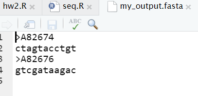

```{r setup, include=FALSE}
knitr::opts_chunk$set(echo = TRUE)
require(seqinr)
choosebank("genbank")
```

## Task A

```{r taskA, echo=TRUE}
# Run the query
result <- query("query1", query = "SP=Chlamydia trachomatis AND M=DNA")
print(paste(result$nelem, "sequences were retrieved."))
```

## Task B

```{r taskB}
# Get all the sequences
all_sequences <- result$req
# Get the length vector
length_vector <- getLength(all_sequences)

# Get the shortest sequence(s)
shortest_seq <- all_sequences[length_vector == min(length_vector)]

# Print the length of the shortest sequence(s)
print(paste("Length of shortest sequence:", min(length_vector)))

# Print the accession number(s) of the shortest sequence(s)
print(paste("Accession Numbers:", paste(getName(shortest_seq), collapse = ", ")))

# Export the data to a FASTA file
write.fasta(getSequence(shortest_seq), names = getName(shortest_seq), file.out = "my_output.fasta")
```
  
  


  
  
## Task C
```{r taskC, tidy=TRUE, tidy.opts=list(width.cutoff=60)}
# Get the 100th sequence
seq_100 <- getSequence(all_sequences[[100]])

# i. Calculate GC content for each 500-nucleotide chunk
gc_chunks <- sapply(split(seq_100, ceiling(seq_along(seq_100) / 500)), GC)
print(gc_chunks)

# ii. Create a sliding window scattered plot of GC content using red lines
plot(seq(from = 1, to = length(seq_100), by = 100), sapply(split(seq_100, ceiling(seq_along(seq_100) / 100)), GC), type = "b", col = "red", xlab = "Nucleotide Start Position", ylab = "GC")
```

## Task D

```{r taskD}
# Get the longest sequence
longest_seq <- all_sequences[length_vector == max(length_vector)]
lseq <- getSequence(longest_seq)

# i. Print the count of all the nucleotide bases in the sequence
no_of_bases <- table(lseq)
print(no_of_bases)

# ii. Calculate the percentage of each base and plot it using a pie chart
prop_of_bases <- proportions(no_of_bases)
print(prop_of_bases)
colors = c("blue", "yellow", "green", "red")
labs <- names(prop_of_bases)

pie(prop_of_bases, labels = paste(labs, "=", round(prop_of_bases * 100, 2), "%"), col = colors)

# iii. Generate a random sequence with the same length and base composition
random_seq <- sample(names(no_of_bases), getLength(lseq), replace = TRUE, prob = prop_of_bases)

# iv. Repeat i. and ii. for the randomly generated sequence from iii.
random_count <- table(random_seq)
print(random_count)

random_prop <- proportions(random_count)
print(random_prop)

pie(random_prop, labels = paste(names(random_prop), "=", round(random_prop * 100, 2), "%"), col = colors)
```

## Task E


```{r taskE}
# Create a function that return the top 3 most frequent codons
freq_codons <- function (seq) {
  codons <- count(seq, 3)
  codons <- codons[order(codons, decreasing = TRUE)]
  return (head(codons, 3))
}

# Testing the function on 2 sequences
freq_codons(getSequence(all_sequences[[125]]))

freq_codons(getSequence(all_sequences[[567]]))
```


## Task F

```{r taskF}

# Write a function that returns all under-represented DNA words with a
# specific length
under_represented <- function (seq, length) {
  rep <- rho(seq, wordsize = length)
  return (rep[rep < 1])
}

# Testing the function on sequences of length 2 and 4
under_represented(getSequence(all_sequences[[876]]), 2)
under_represented(getSequence(all_sequences[[876]]), 4)
under_represented(getSequence(all_sequences[[1024]]), 2)
under_represented(getSequence(all_sequences[[1024]]), 4)
```

