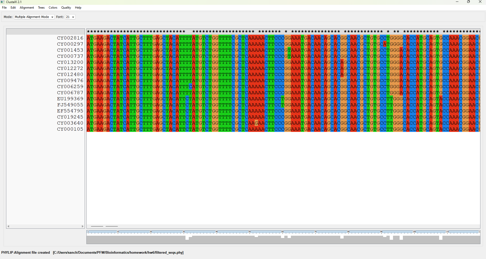

```{r setup, include=FALSE}
knitr::opts_chunk$set(echo=TRUE)
knitr::opts_chunk$set(cache=TRUE)
knitr::opts_chunk$set(tidy=TRUE)
knitr::opts_chunk$set(tidy.opts=list(width.cutoff = 50))

source("../functions/printMultipleAlignment.R")
source("../functions/rootedNJtree.R")
source("../functions/unrootedNJtree.R")
source("../functions/cleanAlignment.R")

require(seqinr)
require(dplyr)
require(ape)
require(Biostrings)
require(stringi)
```

# Task A
```{r taskA}
  seqs <- read.fasta(file = "usflu.fasta")
```

# Task B
I just selected the first strain from each year.
```{r taskB}
  annotations <- read.csv("usflu.annot.csv")
  strains <- annotations %>% group_by(year) %>% slice_head(n = 1)
  print(strains)
  filtered_seqs <- seqs[strains$accession]
  write.fasta(sequences = filtered_seqs, names = getName(filtered_seqs), file.out = "filtered_seqs.fasta")
```

\pagebreak

# Task C



{height=45%}
\pagebreak

# Task D
```{r taskD}
  aln <- read.alignment(file = "filtered_seqs.phy", format = "phylip")
  clean_aln <- cleanAlignment(aln, 75, 30)
  dist_matrix <- dist.dna(as.DNAbin(clean_aln))
  print(dist_matrix)
  print(max(dist_matrix))
  print(min(dist_matrix))
```
The maximum distance is between FJ549055 and CY012480.\
The minimum distance is between CY000737 and CY001453.


# Task E
```{r taskE, echo=FALSE}
  unrootedNJtree(clean_aln, "DNA", "phylogram")
```


# Task F
The most closely related sequences based on the tree are CY000737 and CY001453.\
Yes, this is consistent with my answer from part d.


# Task G
```{r taskG}
  # Using the fasta file directly
  sars_seq <- read.fasta(file = "sars.fasta")
  name <- getName(sars_seq)
  sars_seq <- getSequence(sars_seq)
  print(DNAString(c2s(sars_seq[[1]])))
  write.fasta(sars_seq, name, file.out = "filtered_seqs.fasta", open = "a")
  new_aln <- read.alignment(file = "filtered_sequences_1.phy", format = "phylip")
  dist_matrix_1 <- dist.dna(as.DNAbin(new_aln))
  print(dist_matrix_1)
  rootedNJtree(new_aln, "AB257344.1", "DNA")
```


# Task H
For the tree in part (e), most of the groups have a confidence value of more than 90%. A couple of nodes have values less than 80 (71 and 62). I would say that the groups have been formed with moderately high accuracy.\
For the tree in part (g), the bootstrap values seem to be on the lower side, and this suggests that the groups haven't been formed with much accuracy.


# Task I
```{r taskI}
  long_substr <- function (data) {
    is_substr <- function (find, data) {
      if(length(data) < 1 && nchar(find) < 1) {
        return (FALSE)
      }
      
      for (i in 1:length(data)) {
        if (!stri_detect_fixed(data[[i]], find)) {
          return (FALSE)
        }
      }
      
      return (TRUE)
    }
    
    data <- data$seq
    substr <- " "
    if (length(data) > 1 && nchar(data[[1]]) > 0) {
      for (i in 1:nchar(data[[1]])) {
        for (j in 1:(nchar(data[[1]]) - i + 1)) {
          if (j > nchar(substr) && is_substr(substring(data[[1]], i, i + j), data)) {
            substr <- substring(data[[1]], i, i + j)
          }
        }
      }
    }
    
    return (substr)
  }

  result <- long_substr(clean_aln)
  print(result)
```


